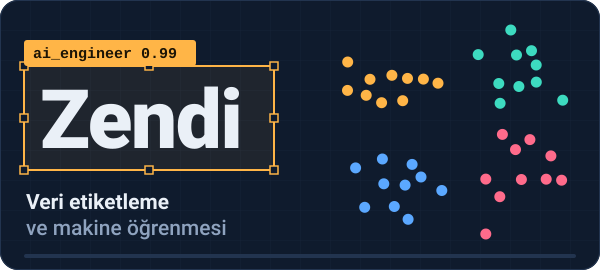
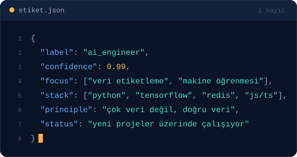

  

  

  
  
  

---

## 👨‍💻 Hakkımda

  

Yapay zekâ ve makine öğrenmesi üzerine çalışıyorum. İyi bir modelin temelinin temiz ve doğru etiketlenmiş veri olduğuna inanıyor, veri hazırlama süreçlerini hızlandıran araçlar geliştirmeyi seviyorum.

> [!TIP]
> Bir proje fikrin ya da işbirliği teklifin varsa Discord'dan yazabilirsin.

---

## 🛠 Teknolojiler

<b>AI ve veri</b>

  
  
  

<b>Web</b>

  
  
  
  

<b>Araçlar</b>

  
  
  

---

## 🔄 Çalışma akışım

  

Ham veriden modele giden yolda her adımın kalitesi bir sonrakini belirler. Bu yüzden önce veriye, sonra modele bakarım.

---

## 💭 Prensiplerim

- Çok veri değil, doğru veri.
- Otomatikleştir, ama sonucu doğrula.
- Basit tut, sonra ölçekle.

---

## 📂 Projeler

> [!NOTE]
> Yeni projeler yolda. Takipte kal.

<!-- Proje eklemek için bu satırı kullan:
- [**PROJE-ADI**](https://github.com/zenndi/PROJE-ADI): kısa açıklama
-->

---

## 📊 GitHub istatistikleri

  

---

## 🌍 Bağlantılar

  
  

  

